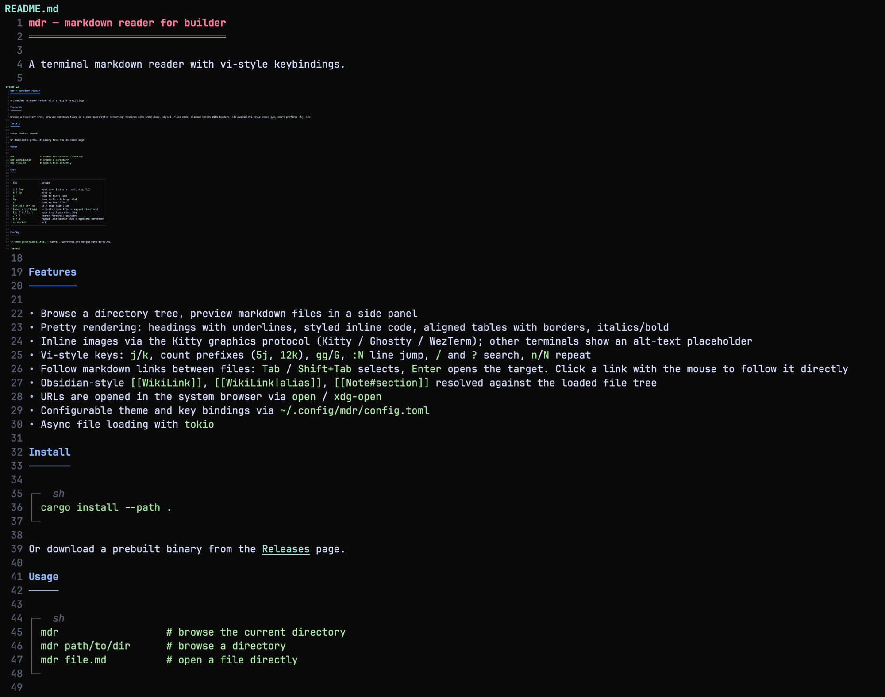

# mdr — markdown reader for builder

A terminal markdown reader with vi-style keybindings.



## Features

- Browse a directory tree, preview markdown files in a side panel
- Pretty rendering: headings with underlines, styled inline code, aligned tables with borders, italics/bold
- Inline images via the Kitty graphics protocol (Kitty / Ghostty / WezTerm); other terminals show an alt-text placeholder
- Vi-style keys: `j`/`k`, count prefixes (`5j`, `12k`), `gg`/`G`, `:N` line jump, `/` and `?` search, `n`/`N` repeat
- Follow markdown links between files: `Tab` / `Shift+Tab` selects, `Enter` opens the target. Click a link with the mouse to follow it directly
- Obsidian-style `[[WikiLink]]`, `[[WikiLink|alias]]`, `[[Note#section]]` resolved against the loaded file tree
- URLs are opened in the system browser via `open` / `xdg-open`
- Configurable theme and key bindings via `~/.config/mdr/config.toml`
- Async file loading with `tokio`

## Install

```sh
cargo install --path .
```

Or download a prebuilt binary from the [Releases](https://github.com/iyunbo/mdr/releases) page.

## Usage

```sh
mdr                  # browse the current directory
mdr path/to/dir      # browse a directory
mdr file.md          # open a file directly
```

## Keys

| Key                | Action                                        |
|--------------------|-----------------------------------------------|
| `j` / `Down`       | move down (accepts count, e.g. `5j`)          |
| `k` / `Up`         | move up                                       |
| `gg`               | jump to first line (`5gg` = jump to line 5)   |
| `G`                | jump to last line                             |
| `:N`               | jump to line N (e.g. `:42<Enter>`)            |
| `Ctrl+d` / `Ctrl+u` | half-page down / up                          |
| `Ctrl+f` / `Ctrl+b` | full page down / up                          |
| `Enter` / `l` / `Right` | activate (open file, expand dir, or follow selected link) |
| `h` / `Left`       | back / collapse directory                     |
| `Tab` / `Shift+Tab`| select next / previous link in the preview    |
| `Ctrl+O` / `[`     | navigate back through opened files            |
| `Ctrl+]` / `]`     | navigate forward through opened files (some terminals swallow `Ctrl+]` — `]` always works) |
| `/` / `?`          | search forward / backward                     |
| `n` / `N`          | repeat last search same / opposite direction  |
| `Esc`              | cancel a `/`, `?` or `:` prompt               |
| `q`, `Ctrl+C`      | quit                                          |

`Tab` / `Shift+Tab` cycles through links in the preview; `Enter` follows the
highlighted link. A left mouse click on a link opens it directly. Anchors
(`file.md#section`) strip to the file path. URLs are launched via the system
browser (`open` on macOS, `xdg-open` on Linux). Obsidian wiki-links resolve
by searching the loaded file tree for a matching `.md` filename
(case-insensitive); when no tree is loaded, they fall back to a path
relative to the current file.

## Config

`~/.config/mdr/config.toml` — partial overrides are merged with defaults.

```toml
[theme]
heading_color = "blue"
code_color = "green"
line_number_color = "darkgray"   # default
show_line_numbers = true         # default
image_height = 12                # default — rows reserved per inline image

[ui]
mouse = true             # default — set to false to keep terminal selection intact

[keys]
quit = "Q"               # string form
down = ["j", "Down"]     # array form (multiple bindings)
```

## License

Licensed under either of [MIT](https://opensource.org/licenses/MIT) or [Apache 2.0](https://www.apache.org/licenses/LICENSE-2.0) at your option.
